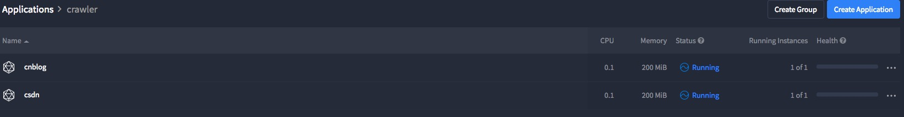
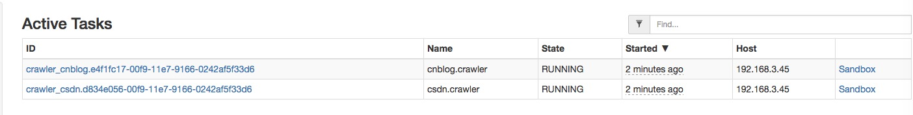

# 大数据搜索
基于scrapy的采集系统，采用reids、kafka、rabbitmq、elasticsearch、mysql、django等技术,打造新生代的分布式数据搜索和数据基础平台



# scrapy cluster

* 存储支持 elasticsearch、mongodb、mysql、solr等nosql数据库
* 下载文件支持保存到 disk,mongodb,fastdfs
* 格式规整
* URL地址的状态、爬虫的状态，保存在redis

# mesos+marathon

基于docker、mesos、marathon等构建云采集

```bash
docker run --name zookeeper --net=host --restart always -d zookeeper

docker run -d \
-e MESOS_HOSTNAME=127.0.0.1 \
-e MESOS_IP=127.0.0.1 \
-e MESOS_QUORUM=1 \
-e MESOS_PORT=8081 \
-e MESOS_ZK=zk://127.0.0.1:2181/mesos \
--name master --net host --restart always \
mesosphere/mesos-master:1.1.01.1.0-2.0.107.ubuntu1404

docker run -d \
-e MESOS_HOSTNAME=127.0.0.1 \
-e MESOS_IP=127.0.0.1 \
-e MESOS_PORT=8082 \
-e MESOS_MASTER=zk://127.0.0.1:2181/mesos \
-e MESOS_RESOURCES="ports:[0-65000]" \
-e MESOS_CONTAINERIZERS="docker,mesos" \
-e MESOS_ATTRIBUTES=rack_id:crawler \
-e MESOS_WORK_DIR=/tmp/mesos \
-e MESOS_CGROUPS_LIMIT_SWAP=true \
-v /var/run/docker.sock:/var/run/docker.sock \
-v /cgroup:/cgroup \
-v /sys:/sys \
-v /usr/local/bin/docker:/usr/local/bin/docker \
--name agent --net host --privileged --restart always \
mesosphere/mesos-slave:1.1.01.1.0-2.0.107.ubuntu1404


docker run -d \
-e MARATHON_HOSTNAME=127.0.0.1 \
-e MARATHON_HTTPS_ADDRESS=127.0.0.1 \
-e MARATHON_HTTP_ADDRESS=127.0.0.1 \
-e MARATHON_MASTER=zk://127.0.0.1:2181/mesos \
-e MARATHON_ZK=zk://127.0.0.1:2181/marathon \
-e MARATHON_EVENT_SUBSCRIBER=http_callback \
--name=marathon \
--net=host \
--restart=always \
mesosphere/marathon:v1.4.1 


docker run -d--name redis -p 6379:6379 redis

docker run -d --name mongo -p 27017:27017 mongo

docker run -d -p 9300:9300 -p 9200:9200 elasticsearch

docker run -p 9092:9092 -e KAFKA_ADVERTISED_HOST_NAME=127.0.0.1 -e KAFKA_CREATE_TOPICS=“crawler” -e KAFKA_ZOOKEEPER_CONNECT=“127.0.0.1:2181” -v /var/run/docker.sock:/var/run/docker.sock wurstmeister/kafka

docker build openslack/crawler:0.1 .

```


# deploy spider with marathon

```json
{
  "id": "crawler/csdn",
  "args": "csdn",
  "cpus": 0.1,
  "mem": 200,
  "disk": 500,
  "instances": 1,
  "container": {
    "docker": {
      "image": "openslack/crawler:0.1",
      "network": "BRIDGE",
      "portMappings": [
        {
          "containerPort": 0,
          "protocol": "tcp",
          "name": null,
          "labels": null
        }
      ]
    },
    "type": "DOCKER",
    "volumes": []
  },
  "env": {},
  "labels": {},
  "healthChecks": [],
  "constraints": [
    [
      "rack_id",
      "CLUSTER",
      "crawler"
    ]
  ]
}
```
